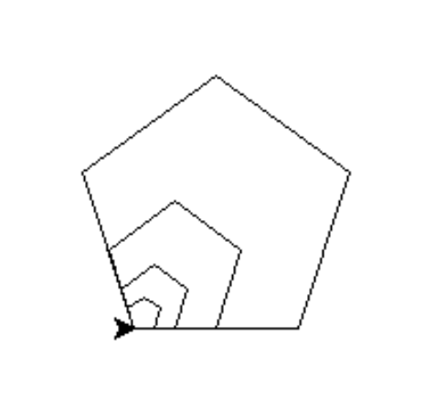

# CIS 112 Assignments

## Assignment 1
Write a Python program to find out number of days in a month.  Your program will ask user to enter month and year and 
display number of days of that month.

1.  Need to figure out whether the years is a leap year or not.

2.  Depends on the result of the step 1, number of days for Feb. will be different.

  

Use functions (finding leap year, finding days in a month).

After producing the output, ask users whether to repeat it or not.  If user wants to repeat, ask year and month again 
and produce the output.  Repeat it until user wants to stop.

Make sure you have comments in your program.

\======================================

Sample output

\======================================

Please enter the 4 digit year: 1969 \
Please enter the month: 2 \
Year 1969 Month 2 has 28 days in a month \
Do you want to repeat? (Y/N)y

 

Please enter the 4 digit year: 2020 \
Please enter the month: 2 \
Year 2020 Month 2 has 29 days in a month \
Do you want to repeat? (Y/N)n

 

Thank you for playing! \
\>>>

## Assignment 2
Write a Python program using turtle to draw polygons.

 

Write a python program using turtle to draw following squares with initial side length for 120.  Each time turtle 
draws, it shrinks both sides of the line by 10 (the actual length of the line will be shrunk by 20 because both ends 
are shrunken by 10) until sides can't be shrunken.  Do not specify how many times the loop needs to be 
executed.  Control the loop execution by checking whether the length of the side is larger than 0.

Here is the output of the program: \

## Assignment 3
Write a Python program using turtle to draw polygons.

 

This assignment mainly uses turtle module but do not use circle() method of the turtle.

You will need to create several functions for this assignment to draw polygons.

1. angle(sides):  calculates the angle to turn with user provided number of sides of the polygon.

2. drawShape(Turtle, sides, length):  Draws the polygon based on the user input of # of sides and lenght of the side.

3. SpinPolygon(Turtle, sides, angle, length, repeat):  Draws the polygon number of times while turn polygon by the 
4. angle on the left each time.   Below is a sample image for rotating 5 times. \

5. ScalePolygon(Turtle, sides, length, sfactor, number): Draws a given number of copies of the specified polygon, 
with each copy drawn with a length and sfactor times the previous length.  i.e. if the sfactor is 2 and number of 
copies is 4 with initial length of 10, it will draw polygon with side length of 10, 20, 40, 80.  Below is 
scaling 4 times. \

## Assignment 4
Write a Python program to identify a number is a prime number or not.  Use function to identify whether input number 
is a prime number or not.    Ask user to provide a number and your program will output whether it is a prime number 
or not.  After displaying output, ask user whether to continue with another number or quit. 

Make sure to use the function to identify whether the input is a prime number or not.  Main program just invoke the 
function.

\=================================================

Sample Output

\=================================================

Please enter a number: 3 \
3 is a prime number. \
Do you want to play again? (Y or N) y

 

Please enter a number: 5 \
5 is a prime number. \
Do you want to play again? (Y or N) y

 

Please enter a number: 11 \
11 is a prime number. \
Do you want to play again? (Y or N) y

 

Please enter a number: 8 \
8 is not a prime number. \
Do you want to play again? (Y or N) y

 

Please enter a number: 10 \
10 is not a prime number. \
Do you want to play again? (Y or N) n

 

Thank you for playing. \
\>>>

## Assignment 5
1. Write a Python program that test the function mand the functions discussed in parts a through g.

&nbsp;&nbsp;&nbsp;&nbsp;&nbsp;&nbsp;Create the following lists:

&nbsp;&nbsp;&nbsp;&nbsp;&nbsp;&nbsp;**inStock** - 2D (row size: 10, column size: 4).

&nbsp;&nbsp;&nbsp;&nbsp;&nbsp;&nbsp;**alpha** - 1D list with 20 elements.

&nbsp;&nbsp;&nbsp;&nbsp;&nbsp;&nbsp;**beta** - 1D list with 20 elements.

&nbsp;&nbsp;&nbsp;&nbsp;&nbsp;&nbsp;**gamma** = [11, 13, 15, 17]

&nbsp;&nbsp;&nbsp;&nbsp;&nbsp;&nbsp;**delta** = [3, 5, 2, 6, 10, 9, 7, 11, 1, 8]

 
 

&nbsp;&nbsp;&nbsp;&nbsp;&nbsp;&nbsp;a. Write the definition of the function **setZero** that initializes any 
one-dimensional list to 0 (**aplha** and **beta**).

&nbsp;&nbsp;&nbsp;&nbsp;&nbsp;&nbsp;b. Write the definition of the function **inputArray** that prompts the user to 
input 20 numbers and stores the numbers into **alpha**.

&nbsp;&nbsp;&nbsp;&nbsp;&nbsp;&nbsp;c. Write the definition of the funciton **doubleArray** that initializes the 
elemets of **beta** to two times the corresponding elements in **alpha**.

&nbsp;&nbsp;&nbsp;&nbsp;&nbsp;&nbsp;d. Write the definition of the function **copyGamma** that sets the elements of 
the first row of **inStock** from **gamma** and the remaining rows \
&nbsp;&nbsp;&nbsp;&nbsp;&nbsp;&nbsp;of **inStock** to three times the previous row of **inStock**.

&nbsp;&nbsp;&nbsp;&nbsp;&nbsp;&nbsp;e. Write the definition of the function **copyAlphaBeta** that stores **alpha** 
into the first five rows of **inStock** and **beta** into the last five rows of \
&nbsp;&nbsp;&nbsp;&nbsp;&nbsp;&nbsp;**inStock**.

&nbsp;&nbsp;&nbsp;&nbsp;&nbsp;&nbsp;f. Write the definition of the function **printArray** that prints any 
one-dimentionsl list.  The funciton must contain only one loop to print any \
&nbsp;&nbsp;&nbsp;&nbsp;&nbsp;&nbsp;one-dimensional list.

&nbsp;&nbsp;&nbsp;&nbsp;&nbsp;&nbsp;g. Write the definition of the function **inStock** that prompts the user to 
input the elements for the first column of **inStock**.  The function \
&nbsp;&nbsp;&nbsp;&nbsp;&nbsp;&nbsp;should then set the elements in the remaingin columns to two times the 
corresponding element in the previous column, minues the \
&nbsp;&nbsp;&nbsp;&nbsp;&nbsp;&nbsp;corresponding element in **delta**.

\*************************************************************************************

OUTPUT:

&ndash; The bold text is the user's input.

&ndash; Use tab after displaying each number.

\*************************************************************************************
<pre>
Alpha after initialization:
0    0    0    0    0    0    0    0    0    0    
0    0    0    0    0    0    0    0    0    0

Enter 20 integers:
<b>1
2
3
4
5
6
7
8
9
10
11
12
13
14
15
16
17
18
19
20</b>

Alpha after reading 20 numbers:
1    2    3    4    5    6    7    8    9    10
11   12   13   14   15   16   17   18   19   20

Beta after a call to doubleArray:
2    4    6    8    10   12   14   16   18   20 
22   24   26   28   30   32   34   36   38   40

inStock after a call to copyGamma:
11      13      15      17
33      39      45      51
99      117     135     153
297     351     405     459
891     1053    1215    1377
2673    3159    3645    4131
8019    9477    10935   12393
24057   28431   32805   37179
72171   85293   98415   111537
216513  255879  295245  334611

inStock after a call to copyAlphaBeta:
1    2    3    4
5    6    7    8
9    10   11   12
13   14   15   16
17   18   19   20
2    4    6    8
10   12   14   16
18   20   22   24
26   28   30   32
34   36   38   40

Enter 10 integers:
<b>21
22
23
24
25
26
27
28
29
30</b>

inStock after a call to setInStock:
21   39   75   147
22   39   73   141
23   44   86   170
24   42   78   150
25   40   70   130
26   43   77   145
27   47   87   167
28   45   79   147
29   57   113  225
30   52   96   184
</pre>
\*************************************************************************************

## Assignment 6
* Your program will take file name and it's content from the user.
* Save all the input from the user to the file that was created. 
* Once user is done with providing the content, display the file content on the monitor.   
* Make sure the validity of the file name. 
* Valid file name should adhere to the following rules:
  * Should begin with Alphabets or "_".
  * Name can consist of digits, Alphabets and "_".
  * Can not contain any special characters.
  * For this assignment, filename needs to have an extension and any extension will be fine.
* If the filename that user provides is not a valid one, you need to inform the user about it and ask for a proper 
name.
* Once proper filename has been entered, take an input line by line.  After each line input, ask user whether to 
add more lines and depends on the response, your program will take additional input or stop taking it.
* Once done with input for a file, your program needs to ask user whether to create another file or not.  Depends 
on the response from the user, your program either stop altogether or start to take another line by line input for 
a new file.
* After closing the file, your program needs to display the file content to the user.
* Once program execution is complete, files should have been created  with all the content provided by the user 
in the directory where your program is.
* For this assignment, use of functions and regular expression is required.

\=====================================================================

Sample input/output   (User input is in **bold**)

 

\>>>

\>>> \
\============= RESTART:  ============= \
Please enter a filename: **abc** \
File name needs to have an extension. \
Plese enter a proper filename: **abc.4#r** \
Filename can contain only Alphabets, digits and "\_". \
Plese enter a proper filename: **23ab.exe** \
Filename only can start with Alphabets or '\_'. \
Plese enter a proper filename: **abc#$.txt** \
Filename can contain only Alphabets, digits and "\_". \
Plese enter a proper filename: **abc@#abc.txt** \
Filename can contain only Alphabets, digits and "\_". \
Plese enter a proper filename: **Test1.txt** \
Please enter a sentence: **This is the first line.** \
Do you want to add more lines? (Y/N) **y** \
Please enter a sentence: **This is the second line.** \
Do you want to add more lines? (Y/N) **n**

This is what's entered into file Test1.txt. \
\============================= \
This is the first line. \
This is the second line. \
\============================= \
Do you want to create another file? (Y/N) **y** \
Let's create another file. \
Please enter a filename: **3ab.doc** \
Filename only can start with Alphabets or '\_'. \
Plese enter a proper filename: **Test.doc** \
Please enter a sentence: **Test.doc the first line.** \
Do you want to add more lines? (Y/N) **y** \
Please enter a sentence: **Test.doc !@#$%&*()** \
Do you want to add more lines? (Y/N) **y** \
Please enter a sentence: **Test.doe the third line.** \
Do you want to add more lines? (Y/N) **n**

This is what's entered into file Test.doc. \
\============================= \
Test.doc the first line. \
Test.doc !@#$%&*() \
Test.doe the third line. \
\============================= \
Do you want to create another file? (Y/N) **n** \
Thank you for playing! \
\>>>

## Assignment 7
Write a Python program which asks filename to be processed from the user and extract pages from the file.  Your 
program will ask for the file names for input and output and then starting and ending pages to extract.

Assume user will enter correct file names but need to verify if the range is correct.  (i.e. ending page doesn't 
exist or ending page number is smaller than starting page)  Use PyPDF2 package for this assignment.

Your program should be able to extract pages and create a file using user inputs.

Sample output (User input is in **bold**)   ====================================

==== RESTART: C:/Jason/PCC/Python/Adv Python/PDFfiles/MultiPagewithInput.py ==== \
Please enter a file name: **pythonlearn.pdf** \
Please enter the beginning page number to extract: **10** \
Please enter the ending page number to extract: **5** \
Your beginning and ending page numbers are not correct. \
Please enter the beginning page number to extract: **10** \
Please enter the ending page number to extract: **450** \
Your ending index is out of range, please enter correct ending page. \
Please enter the beginning page number to extract: **10** \
Please enter the ending page number to extract: **15** \
Please enter output file name: **Extract10.pdf** \
\>>>

## Assignment 8
Write a Python program which concatenates three PDF files together and name merged file as "MergedFile.pdf".

Here are three pdf files that need to be merged: \
[pythonlearn_ch4.pdf](pdfs/pythonlearn_ch4.pdf) \
[pythonlearn_ch5.pdf](pdfs/pythonlearn_ch5.pdf) \
[pythonlearn_ch6.pdf](pdfs/pythonlearn_ch6.pdf)

Output file name needs to be: "MergedFile.pdf".

Do not hardcode file names in the program.  As I showed in my lecture, use regular expression to include all the 
pdf files to be merged.  Also, there may be other types of files but only the pdf files need to be concatenated.

Use PdfFileMerger class as explained during the class.

## Assignment 9
Create a Python program which merges two files together.

[pythonlearn_ch8MissingPages.pdf](pdfs/pythonlearn_ch8MissingPages.pdf) \
[From_pythonlearn_ch8.pdf](pdfs/From_pythonlearn_ch8.pdf)

 

The first file (pythonlearn_ch8MissingPages.pdf) has missing pages (95 - 98), and the second file 
(From_pythonlearn_ch8.pdf) has missing page.  Make sure missing pages are merged into the first file properly.

## Project 1
Write a Python program for a calculator.  Your program should present a calculator same as following picture in 
button arrangement and features.

* It needs to be able to carry out addition, subtraction, division and multiplication.
* It needs to be able to handle positive and negative numbers.
* It needs to be able to accept integers and floating point numbers.
* Clear button is to clear the screen during calculation or after the calculation.  When this button is pressed, 
windows needs to be cleaned as in the above picture.
* For all buttons (numbers and functions), you will need to use Lambda functions.
* All buttons need to be placed exactly same as above picture.
* Entire Calculator size and button size should be larger than the picture since it was reduced to display without 
taking up too much space.
* You will need to use several functions.
* Make sure to provide proper comments for the program.
* Windows color needs to be different than button or frame color.
* Frame color and button color needs to be different.
* Only use tkinter package.
* Do not create a class for it. 
* Only use functions for it.